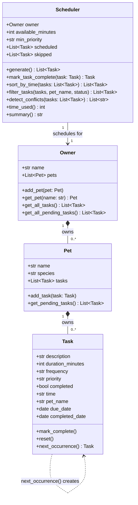

# PawPal+ UML Class Diagram

> Updated to match final `pawpal_system.py` implementation.

---

## What changed from the initial design

| Area | Initial design | Final implementation |
|---|---|---|
| `Task` fields | `description`, `duration_minutes`, `frequency`, `priority`, `completed` | Added `time`, `pet_name`, `due_date`, `completed_date` |
| `Task` methods | `mark_complete()`, `reset()` | Added `next_occurrence()` — spawns the next recurring instance |
| `Pet.add_task()` | Added task to list | Now also stamps `task.pet_name = self.name` |
| `Owner` methods | `add_pet()`, `get_all_tasks()`, `get_all_pending_tasks()` | Added `get_pet(name)` — used by Scheduler to look up a pet by name |
| `Scheduler` methods | `generate()`, `time_used()`, `summary()` | Added `mark_task_complete()`, `sort_by_time()`, `filter_tasks()`, `detect_conflicts()` |
| `Scheduler → Owner` | Unnamed association | Explicit — Scheduler holds an `owner` reference and delegates pet lookup to it |
| `Task → Task` | Not modelled | Added self-dependency arrow for `next_occurrence()` |
| Module constants | `PRIORITY_RANK` | Added `RECURRENCE_DAYS` to drive timedelta logic |
